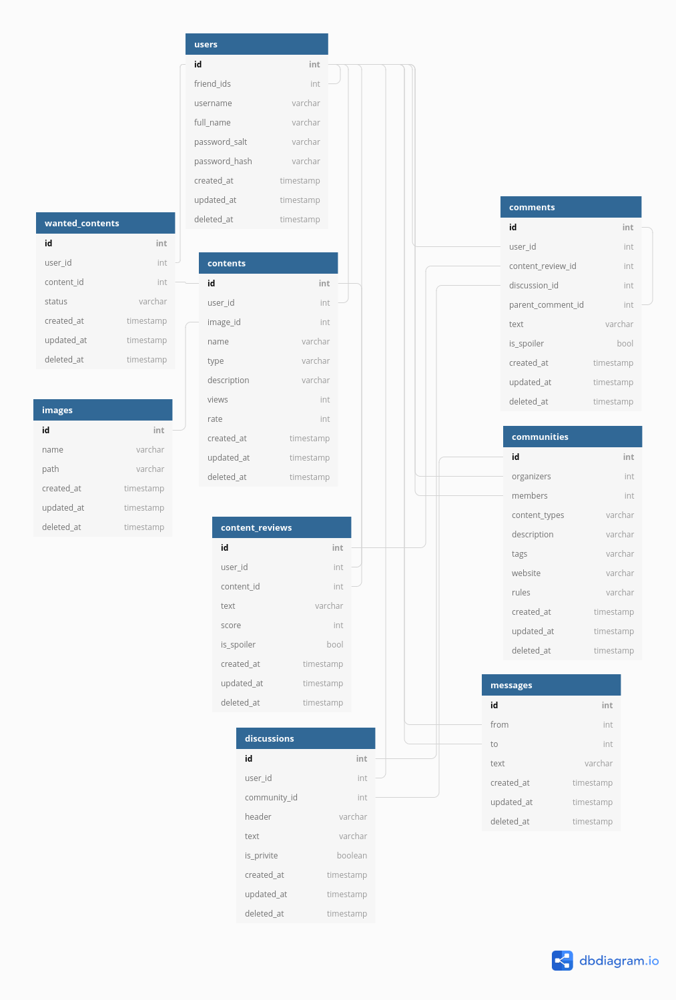

## Basic database diagram
[https://dbdiagram.io/](https://dbdiagram.io/ "Click to try it")

### Preview


### Source
```
Table users{
  id int [pk, increment]
  friend_ids int [not null, ref: > users.id] // user id array
  username varchar
  full_name varchar
  password_salt varchar
  password_hash varchar
  created_at timestamp
  updated_at timestamp
  deleted_at timestamp
}

Table contents{
  id int [pk, increment]
  user_id int [not null, ref: > users.id]
  image_id int [not null, ref: - images.id]
  name varchar [not null]
  type varchar [not null, ref: > content_types.id]
  description varchar [not null]
  views int [default: 0]
  rate int [default: null]
  created_at timestamp
  updated_at timestamp
  deleted_at timestamp
}

Table content_types{
  id int [pk, increment]
  type varchar [not null] //game, movie ...
  created_at timestamp
  updated_at timestamp
  deleted_at timestamp
}

Table comments{
  id int [pk, increment]
  user_id int [not null, ref: > users.id]
  review_id int [default: null, ref: > reviews.id]
  post_id int [default: null, ref: > posts.id]
  content varchar [not null]
  is_parent boolean [default: 0] // for nested comment
  parent_id int [not null, ref: > comments.id]
  created_at timestamp
  updated_at timestamp
  deleted_at timestamp
}


table wanted_contents{
  id int [pk, increment]
  user_id int [not null, ref: > users.id]
  content_id int [not null, ref: > contents.id]
  status varchar [not null]
  created_at timestamp
  updated_at timestamp
  deleted_at timestamp
}

table reviews{
  id int [pk, increment]
  user_id int [not null, ref: > users.id]
  content_id int [not null, ref: > contents.id]
  content varchar
  score int
  created_at timestamp
  updated_at timestamp
  deleted_at timestamp
}

table images{
  id int [pk, increment]
  //owner_id int [not null, ref: < users.id]
  name varchar [not null]
  path varchar [not null]
  created_at timestamp
  updated_at timestamp
  deleted_at timestamp
}

table messages{
  id int [pk, increment]
  from int [not null, ref: - users.id]
  to int [not null, ref: - users.id]
  content varchar [not null]
  created_at timestamp
  updated_at timestamp
  deleted_at timestamp
}

table communities{
  id int [pk, increment]
  organizers int [not null, ref: > users.id] //user id array
  members int [not null, ref: > users.id] //user id array
  created_at timestamp
  updated_at timestamp
  deleted_at timestamp
}

table posts{
  id int [pk, increment]
  user_id int [not null, ref: > users.id]
  content varchar [not null]
  is_privite boolean [default: 0]
  created_at timestamp
  updated_at timestamp
  deleted_at timestamp
}
```